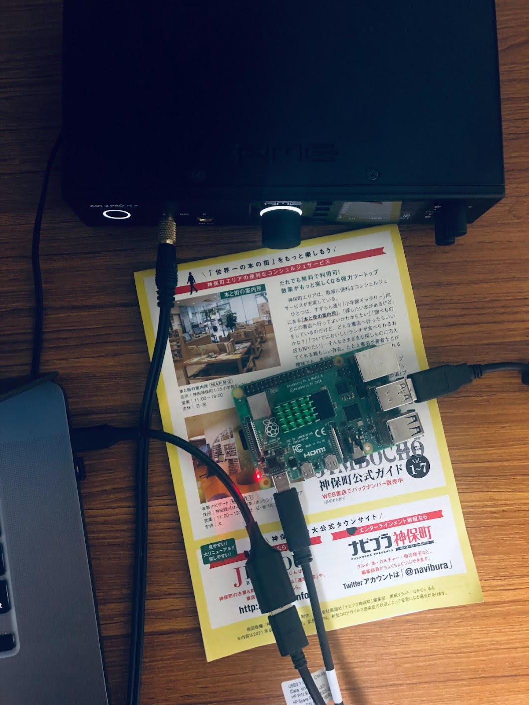

# CamillaDSP Gadget

A USB gadget setup for CamillaDSP, and provides similar DSP pipeline as RME ADI-2 DAC/Pro.

# Introduction

The [CamillaDSP](https://github.com/HEnquist/camilladsp/) project provides a seamless approach to do DSP system-wide on all major desktop operating systems, with various DSP features ready to be used, such as [Loudness](https://en.wikipedia.org/wiki/Loudness_compensation), [Convolution](https://en.wikipedia.org/wiki/Convolution), or [Parametric EQ](https://en.wikipedia.org/wiki/Equalization_(audio)#Parametric_equalizer).  It utilizes a setting file that can be sent to the [websocket](https://henquist.github.io/0.6.3/websocket.html) in run time. 

Starting from Linux 5.18, UAC2 Audio gadget code is completed. When used with CamillaDSP, it is possible for a low power device such as Raspberry Pi 4 to be programmed to behave like a UAC2 device, which takes audio data from a computer, processes it, and sends it to an external DAC via USB. 

The [CamillaDSP-Monitor](https://github.com/Wang-Yue/CamillaDSP-Monitor) project provides a pipeline very similar to the RME ADI-2 DAC/Pro has. The program provides an easy interface to access various useful DSP features powered by CamillaDSP. Users can enable/disable complex DSP functionalities with just one or two key presses. It also displays a very useful spectrum analyzer. 

This project is a fork from the CamillaDSP-Monitor project. We provide guides to setup the Raspberry Pi 4 as USB gadget, and scripts to make the DSP flow working. The hardware is able to perform 120 biquads for spectrum analyzer (same as ADI-2) and render it on screen. It is capable of oversampling audio to 705.6 or 768kHz and processing complicated FIRs and IIRs for dual channels. The Pi clock is synced to the external DAC. 

Here's a photo showing the setup.


Here's a screenshot for the user interface.


Here's a video [demo](https://www.youtube.com/watch?v=OLZ43epCpHQ).

# Installation Setup

1. Compile Linux kernel 5.18 or up and install it to Raspberry Pi version 4 or up.
2. Compile `gaudio_ctl` from `https://github.com/pavhofman/gaudio_ctl/` and `camilladsp` version 1.1 or up from `https://github.com/HEnquist/camilladsp`. Install both binaries to `/usr/local/bin/`. 
3. Install [PyCamillaDSP](https://github.com/HEnquist/pycamilladsp/) library.
4. Add the line `dtoverlay=dwc2` to `/boot/config.txt`.
5. Add two lines to `/etc/modules`:
```
dwc2
g_audio
```
6. Create file `/etc/modprobe.d/usb_g_audio.conf`:
```
options g_audio c_srate=44100,48000,88200,96000,176400,192000,352800,384000,705600,768000 c_ssize=4 p_chmask=0
```
7. Put `asound.conf` to `/etc`
```
pcm.gadget {
    type dsnoop
    ipc_key 1201
    ipc_key_add_uid yes
    slave {
        pcm "hw:CARD=UAC2Gadget"
        buffer_size 8192  # ditto
    }
}
```
8. Put `camilladsp.service`, `gaudio_ctl.service`, `spectrum.service` from the project (they are located in `setting/etc/systemd/system`) into `/etc/systemd/system/` and run
```
systemctl enable camilladsp.service gaudio_ctl.service spectrum.service
```
9. Put everything in the `cdsp` folder from the project into `/home/pi/camilladsp`.
10. Reboot
11. run `gui.py` to control DSP pipeline.
12. You can edit parameters in `dsp.yml` and the GUI program will update the DSP in runtime.
